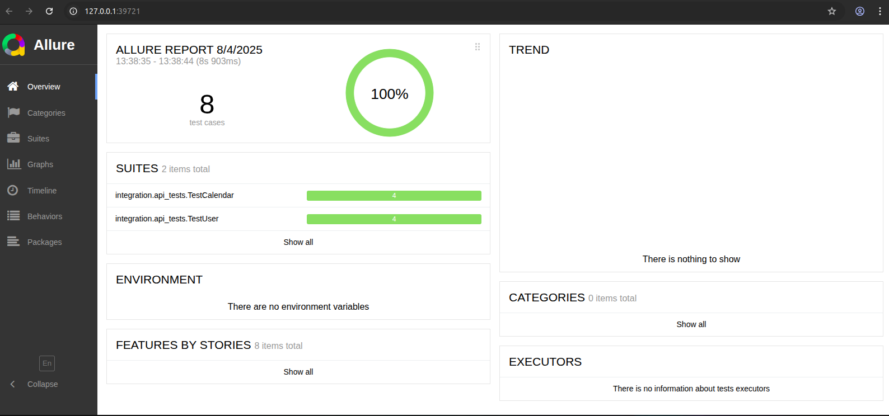

## Test automation with restAssured framework (java)
The repository contains API tests for svc-calendar and svc-user services

### Setup
Install the following:       
1 [Java 17 JDK](https://docs.oracle.com/en/java/javase/17/install/overview-jdk-installation.html)  
2 [Maven 3.x](https://maven.apache.org/install.html)   
3 [Allure report](https://allurereport.org/docs/install/)   
4 Clone the repository from GitHub     
    ```git clone https://github.com/martinokafor/API-test-restAssured.git```     

### Build and execute test from the terminal
1 Navigate to the `tests` module from root directory  ``` cd tests/ ```   
2 Build test code       
``` mvn clean test-compile ```           
3 Execute test    
``` mvn test ```


### Test reporting
- Verify that there is a `/allure-results` folder created inside `tests` module after executing the test       
- Run the allure command on the terminal ``` allure generate --clean ``` to generate the `/allure-report` folder    
- Run the command ``` allure open ``` to open the allure report on the default browser
      

